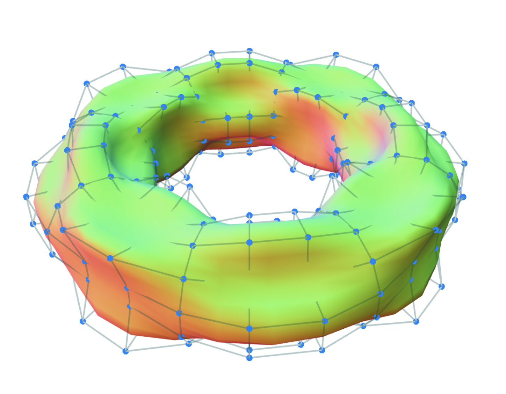
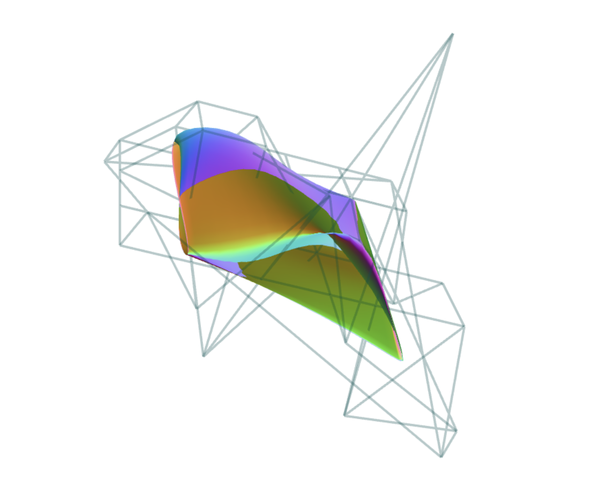

# Bspline fitting

This Code implements 3-dimensional [Non-Uniform Rational B-Splines][nurbs] (NURBS). 

## Installation

```bash
$ npm init
(then enter many times... 
$ npm install
$ npm run start
( the first example)
$ npm run start2
( the second example)
$ node src/ex3.js
( the third example)
```

## Overview



