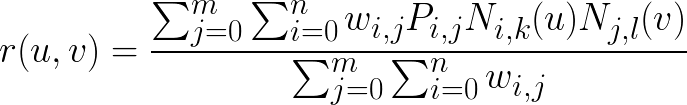
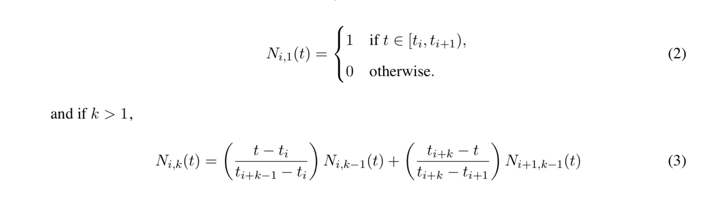

# Bspline fitting

本代码实现三维的 Non-Uniform Rational B-Splines (NURBS). 

#### 1. 算法思想

三维NURBS公式如下所示



其中N(i, j)的定义为：

给予一个${t_{i}:0,1,2...n+k}$的控制数组



综上可以知道，给予一个(n+1) * (m+1) * 3的点阵以及一个(n+k+1)的控制点阵，(n+l+1)的控制点阵(代码默认情况下把权重进行均匀化为0,1,2…)，以及(n+1) * (m+1)的权重值，这样可以定义一个曲面。


#### 2. 代码解释

在画曲面的部分参考了https://github.com/StandardCyborg/nurbs，使用了webgl, budo等库

核心代码在Bspline.js，使用了js的类进行包装，定义的方法如下所示

```js
  const model = {
    points: pack([ 	[ [0, 0, -1], 	[1, 0, 0], 	[2, 0, 0], 	[3, 0, 0] , 	[4, 0, 0], [5, 0, 0] ],[ [0, -1, 0], 	[1, -1, 1], 	[2, -1, 1], 	[3, -1, 0] , [4, -1, 0], [5, -1, 0]	],[ [0, -2, 0], 	[1, -2, 1], 	[2, -2, 1], 	[3, -2, 0] , [4, -2, -0.2], [5, -2, -1.2] 	],[ [0, -3, 0], 	[1, -3, 0], 	[2, -3, -2.3], 	[3, -3, 0] , [4, -3, 0], [5, -3, 0] ],[ [0, -4, 0], 	[1, -4, 0], 	[2, -4, 0], 	[3, -4, 4] , [4, -4, -2], [5, -4, 0]  ],[ [0, -5, 1.2], [1, -5, 0], 	[2, -5, 2], 	[3, -5, 0] , [5, -5, -1], [5, -5, -1.5]]]),
    weights: pack([
      [1, 1, 1, 1, 1, 1],
      [1, 1, 1, 1, 1, 1],
      [1, 1, 1, 1, 1, 1],
      [1, 1, 1, 1, 1, 1],
      [1, 1, 1, 1, 1, 1],
      [1, 1, 1, 1, 1, 1],
    ]),
    boundary: ['closed', 'closed'],
    degree: [5, 5],
  };
surface = new Bspline(model.points, model.weights, model.degree, model.boundary);
/*
Bspline:
points: ndarray (n+1) * (m+1) * 3 点阵(P)
weights ndarray (n+1) * (m+1) 权重(w)
boundry: array 2 曲面开闭
degree: [k, l]
*/

result = surface.evaluate([], u, v);
/* 
输入u，v得到相应的参数
*/
```


#### 3. 例子

```bash
$ npm init
(then enter many times... 
$ npm install
$ npm run start
( the first example)
$ npm run start2
( the second example)
$ node src/ex3.js
( the third example)
```


#### 4. 结果


